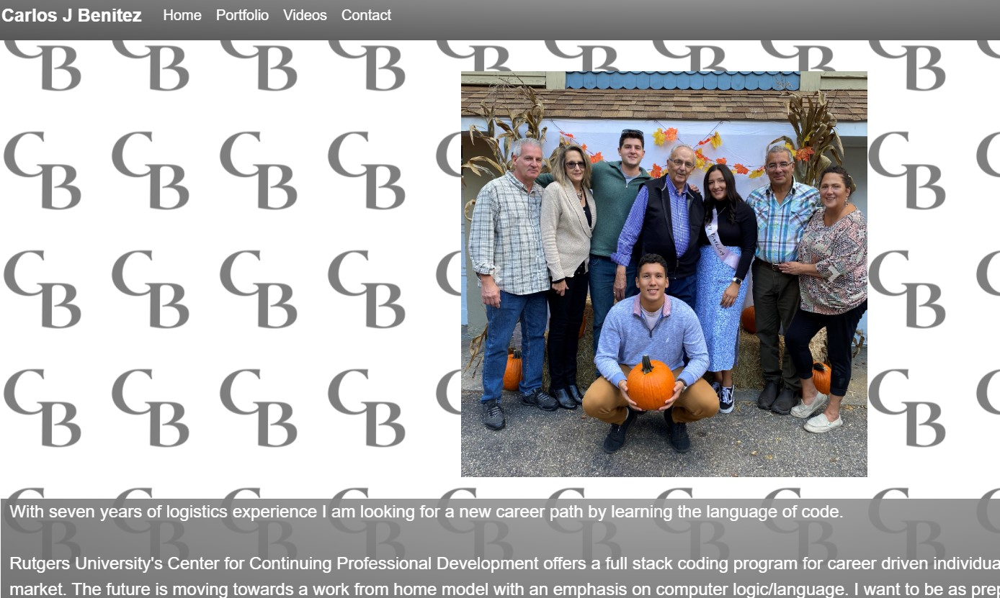

# React: Portfolio

## Description 

I have updated the portfolio I have in my other repository so that it works with React. This is a much better way to organize html, css, and javascript.

## Installation

This is a React application so if you pull this repo you will need to follow all the same steps for other React applications.

## Usage 

You can use this page to connect with me, view some of my work, or send me a message using the contact page. If you like any of my work or hate it feel free to let me know.

## Credits

I would like to give a lot of credit to my TA Leigh Tracey she helped me so much understand the concepts needed for this assignment. Also my tutor Phil Loy gave me a lot of pointers with React.
